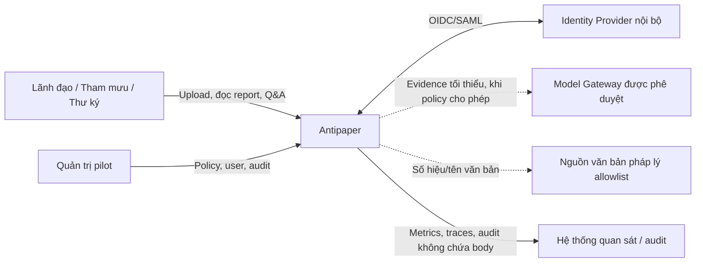
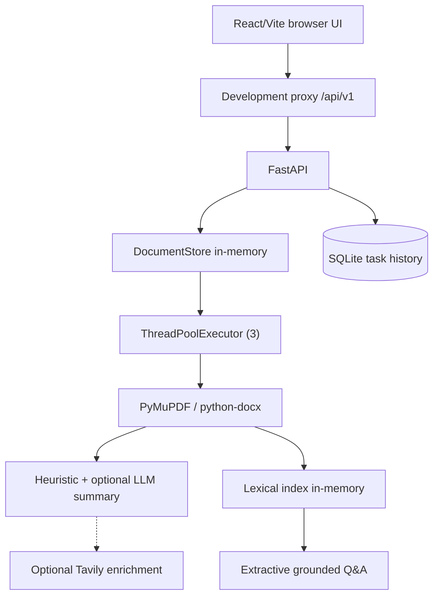
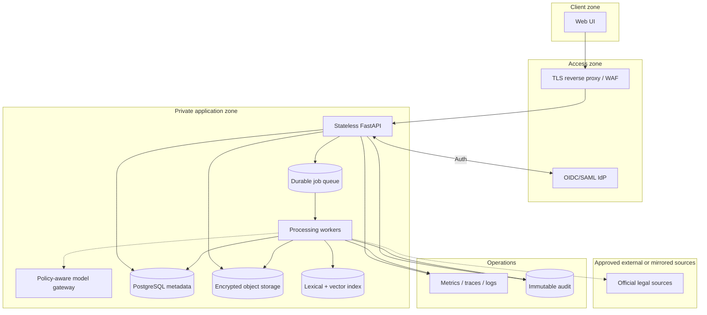
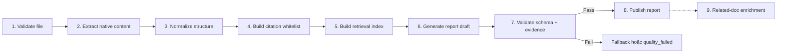
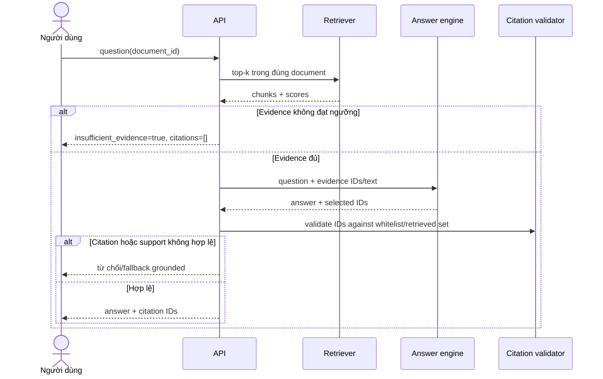

# Architecture — Antipaper

## 1. Context

Antipaper là hệ thống document intelligence có yêu cầu provenance cao hơn chatbot
thông thường. Đơn vị atomic của niềm tin không phải câu trả lời của mô hình mà là
`DocumentChunk` gắn metadata nguồn do parser xác lập. Tất cả summary, thuật ngữ, câu
hỏi và Q&A chỉ tham chiếu tới các chunk hợp lệ.

Kiến trúc dưới đây mô tả cả runtime MVP hiện tại và target pilot. Hai kiến trúc không
được đánh đồng trong đánh giá an toàn hoặc capacity.

## 2. Problem Statement

Hệ thống phải tạo report dưới 60 giây nhưng vẫn:

- bảo toàn page/Điều/Khoản từ nguồn;
- từ chối khi evidence yếu;
- suy giảm an toàn khi LLM/search provider lỗi;
- không gửi tài liệu nội bộ ra dịch vụ công cộng khi chưa duyệt;
- mở rộng từ demo đơn process sang pilot nhiều người dùng mà không phá API v1.

## 3. Technical Deep-Dive

### 3.1 System context



Đường nét đứt là tích hợp tùy chính sách. Với tài liệu nội bộ, model và legal search
phải nằm trong trust boundary hoặc bị tắt.

### 3.2 Kiến trúc MVP hiện tại



#### Đặc tính runtime

- Mỗi upload có UUID mới; cùng bytes không được cache/reuse.
- File bytes, page text, report và index chỉ tồn tại trong process memory.
- SQLite chỉ lưu metadata lịch sử; restart vẫn thấy history nhưng không mở lại report.
- Worker deadline mặc định 48 giây được kiểm sau orchestration; hiện chưa bảo đảm hủy
  computation/network call tại deadline.
- Related-document enrichment chạy nền và không chặn report cơ bản.
- Q&A hiện dùng lexical retrieval và extractive answer; client LLM của summary không
  được inject vào `GroundedQAService`.

#### Giới hạn

| Rủi ro | Tác động |
|---|---|
| Process crash/restart | Mất file, report, page và index đang active |
| Nhiều API replicas | Mỗi replica có state khác; document ID không định tuyến được |
| Header `X-User-ID` tự khai | Không xác thực và không bảo vệ document ownership |
| Base64 preview trong JSON | Tăng memory/bandwidth |
| Thread pool cố định | Không có durable queue/backpressure/DLQ |
| DOCX pseudo-page 1 | Không thể hứa dẫn đúng trang in |

### 3.3 Kiến trúc target pilot



### 3.4 Pipeline xử lý



#### Invariants

1. `chunk_id` duy nhất trong một document và immutable theo một parser version.
2. Citation page/structure/excerpt phải khớp chunk authoritative.
3. Generated output chỉ chứa `citation_ids`; renderer join metadata từ server store.
4. Publish là atomic: client không thấy report nửa hoàn chỉnh.
5. `completed` chỉ dùng khi các output bắt buộc và quality gate đã hoàn tất.
6. Enrichment không được sửa nội dung grounded của report; chỉ thêm provenance riêng.

### 3.5 Chunking và citation

Parser đọc từng trang PDF, nhận diện boundary Chương/Mục/Điều/Khoản/Điểm bằng pattern
deterministic và tạo ID dạng `P{page}-D{ordinal}`. Excerpt là prefix rút gọn của chunk.
Validator kiểm:

- ID tồn tại trong whitelist;
- ID thuộc retrieval set của request nếu là Q&A;
- metadata page/chapter/article/clause đồng nhất giữa citation và chunk;
- excerpt bắt đầu từ source text;
- không trùng/blank.

MVP API đang expose page/chapter/article/clause nhưng chưa expose `section` và `point`;
API v1 nên bổ sung dưới dạng nullable field để không phá client.

### 3.6 Q&A architecture



Prompt injection trong document được xử lý bằng cách coi document là untrusted data,
không phải instruction. Model gateway không cấp tool hoặc network access cho request
Q&A.

### 3.7 Trạng thái và consistency

State machine chuẩn:

```text
queued -> processing.extracting -> processing.normalizing
       -> processing.indexing -> processing.generating
       -> processing.validating -> completed
Any non-terminal -> failed
```

- Transition phải monotonic và ghi `updated_at`.
- Retry tạo `attempt` mới nhưng không tạo hai report published.
- Status API eventual-consistent; report chỉ readable khi completed.
- Pilot cần optimistic lock/version để worker cũ không overwrite attempt mới.

### 3.8 Reliability, scalability và latency

| Cơ chế | Scalability | Reliability | Latency |
|---|---|---|---|
| Tách API/worker | Scale độc lập | API không giữ job state | Queue overhead nhỏ |
| Bounded concurrency | Chống quá tải provider/CPU | Tránh cascading failure | Có thể tăng queue time |
| Stage timeout/cancellation | Giải phóng tài nguyên | Tránh zombie task | Cho phép fallback sớm |
| Async enrichment | Không chặn critical path | Lỗi độc lập | Report cơ bản nhanh |
| Hybrid retrieval | Scale theo index | Exact + semantic fallback | Tốn thêm query |
| Precomputed page render | Giảm CPU khi click | Có derivative cần quản trị | Mở citation nhanh |

Capacity pilot phải đo arrival burst trước giờ họp, không chỉ average. Ví dụ 30 người
cùng upload lúc 07:45 là workload khác hoàn toàn 30 upload rải cả ngày.

### 3.9 Deployment profiles

| Profile | Dữ liệu cho phép | Model/search | Storage | Mục đích |
|---|---|---|---|---|
| Public demo | Chỉ tài liệu công khai | Provider đã cấu hình | In-memory + local history | Hackathon |
| Restricted pilot | Nội bộ theo phân loại được duyệt | Private/on-prem hoặc tắt | Private encrypted stores | Một đơn vị/phòng ban |
| Production | Theo policy chính thức | Gateway governed | HA, backup, retention | Nhiều đơn vị |

## 4. Strategic Recommendations

### 4.1 Architecture Decision Records

| ADR | Quyết định | Trạng thái |
|---|---|---|
| ADR-001 | Citation metadata thuộc parser, không thuộc LLM | Accepted |
| ADR-002 | Fail-closed khi evidence/citation không hợp lệ | Accepted |
| ADR-003 | Mỗi upload tạo task/document mới; không reuse ngầm | Accepted cho MVP |
| ADR-004 | Report active in-memory, history SQLite | Accepted chỉ cho demo |
| ADR-005 | Related-doc enrichment ngoài critical path | Accepted |
| ADR-006 | Pilot dùng stateless API + durable queue + private persistence | Proposed |
| ADR-007 | Hybrid retrieval giữ lexical exact path | Proposed |
| ADR-008 | Model access qua policy-aware gateway | Proposed |

### 4.2 Thứ tự hardening

1. Sửa identity/authorization và trust boundary.
2. Durable job state, storage, cancellation và idempotency.
3. Quality gate atomic trước `completed`.
4. Observability không lộ nội dung và benchmark theo burst.
5. Sau đó mới mở OCR, vision, semantic retrieval và toàn-kho.
