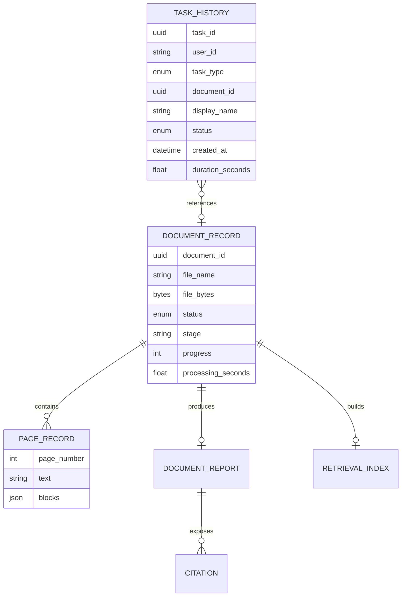
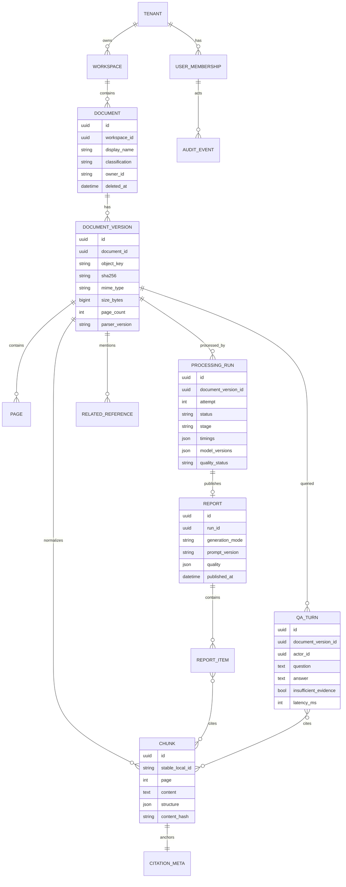

# Data Model and Lifecycle — Antipaper

## 1. Context

Antipaper xử lý ba lớp dữ liệu khác nhau:

1. **Source data:** file PDF/DOCX và trang render.
2. **Derived content:** text, chunk, index, report, answer, citation.
3. **Operational metadata:** user/task/status/timing/error/audit.

Mỗi lớp có mức nhạy cảm và retention khác nhau. “Không persist file” không đồng nghĩa
“không lưu dữ liệu”: history hiện tại vẫn giữ tên file và tới 160 ký tự câu hỏi.

## 2. Problem Statement

MVP lưu source/derived data trong memory và task metadata trong SQLite. Thiết kế này
giảm dấu vết dữ liệu cho demo nhưng mất report khi restart, không hỗ trợ scale-out và
chưa có quyền/xóa/retention. Pilot cần data model durable mà không làm yếu nguyên tắc
provenance hoặc mở rộng thu thập dữ liệu quá mức cần thiết.

## 3. Technical Deep-Dive

### 3.1 Model hiện tại



| Đối tượng | Nơi lưu | Qua restart | Ghi chú |
|---|---|---:|---|
| Original bytes | Process memory | Không | Dùng để ingest và render PDF page |
| Page text/blocks | Process memory | Không | DOCX hiện là một page logic |
| Normalized chunks/citations | Process memory | Không | Authoritative cho provenance |
| Retrieval index | Process memory | Không | Lexical |
| Report/related docs | Process memory | Không | Enrichment cập nhật report |
| Last question trace | Process memory | Không | Chỉ một trace gần nhất/document |
| Task history | SQLite `.runtime/history.sqlite3` | Có | Không lưu report/source |

### 3.2 Hợp đồng normalized document

```text
NormalizedDocument
├── document_id
├── file_name
├── page_count
├── chunks[]
│   ├── chunk_id
│   ├── page
│   ├── text
│   ├── chapter / section / article / clause / point
└── citations{chunk_id -> metadata + excerpt}
```

Invariants:

- `chunk_id` unique;
- `chunk.page <= page_count`;
- citation key phải tham chiếu chunk hiện hữu;
- citation metadata/excerpt phải nhất quán với chunk;
- page number 1-based;
- generated entities chỉ giữ citation IDs, không sao chép metadata như nguồn thứ hai.

### 3.3 Model target pilot



### 3.4 Entity definitions target

| Entity | Purpose | Critical constraints |
|---|---|---|
| Tenant | Administrative security boundary | Không cross-tenant query/index |
| Workspace | Nhóm tài liệu/cuộc họp | ACL và retention policy |
| Document | Logical file record | Classification, owner, soft-delete marker |
| DocumentVersion | Immutable uploaded bytes/version | Hash để integrity, không dùng cross-user dedupe ngầm |
| ProcessingRun | Một attempt pipeline | Monotonic status, version/timing/error |
| Page | Text/render derivative theo trang | Page 1-based; confidence nếu OCR |
| Chunk | Evidence unit | Immutable trong parser version; content hash |
| CitationMeta | Authoritative location | Join từ chunk/page, không từ LLM |
| Report/ReportItem | Published output | Atomic publish; all IDs validate |
| QATurn | Câu hỏi/trả lời | Policy có thể tắt lưu question/answer |
| RelatedReference | Mention và external provenance | Tách source type, publisher, URL, verified_at |
| AuditEvent | Security/administrative action | Append-only, không chứa document body |

### 3.5 Task lifecycle

```text
created_at
  -> queued_at
  -> started_at
  -> stage timestamps
  -> completed_at | failed_at | cancelled_at
  -> expires_at
  -> deleted_at / purge_completed_at
```

`duration_seconds` phải tính theo monotonic clock trong process cho timing; timestamp
UTC dùng cho audit/correlation. Không tính duration bằng phép trừ lẫn wall clock và
`perf_counter`.

### 3.6 Retention baseline đề xuất cho pilot

Các giá trị dưới đây là default đề xuất, chỉ có hiệu lực sau phê duyệt chính sách:

| Data | Default đề xuất | Xóa |
|---|---:|---|
| Original file | 7 ngày hoặc hết cuộc họp, lấy mốc sớm hơn | Object + version + temp copies |
| Extracted pages/chunks/index | Cùng vòng đời original | Cascade purge |
| Report | 30 ngày nếu nghiệp vụ cần | Report items + mappings |
| Q&A content | Không lưu mặc định; nếu bật ≤30 ngày | Question, answer, retrieval trace |
| Task metadata | 90 ngày | Giữ aggregate đã vô danh nếu cần |
| Security audit | Theo chính sách đơn vị, thường dài hơn | Controlled purge/legal hold |
| Metrics không nội dung | 12 tháng đề xuất | Aggregate retention |

Deletion phải bao gồm primary store, object derivatives, vector/lexical index, cache,
preview và backup theo lịch; UI/API trả purge status thay vì hứa xóa tức thì khi backup
còn trong retention.

### 3.7 Data classification

| Lớp | Ví dụ | Xử lý |
|---|---|---|
| Public | Luật/văn bản đã công khai | Cho phép demo; vẫn bảo vệ credential/user data |
| Internal | Dự thảo họp, tài liệu điều hành | Chỉ private approved environment |
| Restricted | Dữ liệu cá nhân/nhạy cảm, tài liệu mật | Ngoài phạm vi cho tới khi có policy/hạ tầng riêng |
| Secret credential | API key/token | Secret manager; không nằm trong document/audit/log |

### 3.8 Integrity và lineage

Mỗi report phải truy được lineage:

```text
report_id
 -> processing_run_id
 -> document_version_id + source_sha256
 -> parser/chunking/retrieval/prompt/model versions
 -> report_item citation IDs
 -> chunk content hashes + page metadata
```

Không dùng SHA-256 để hiển thị nội dung hoặc xác thực user; nó chỉ hỗ trợ integrity,
versioning và phát hiện thay đổi.

## 4. Strategic Recommendations

1. Trước pilot, thêm tenant/workspace/document ownership vào schema trước khi thêm tính
   năng toàn-kho; retrofitting isolation sau rất rủi ro.
2. Tách source, derivative, operational metadata và audit để áp retention khác nhau.
3. Mặc định không lưu nội dung Q&A; hiện code lưu question prefix trong history nên cần
   redaction/migration.
4. Dùng immutable document version và atomic report publish để bảo toàn reproducibility.
5. Thực hiện deletion verification bằng job/audit, không chỉ soft delete database row.

