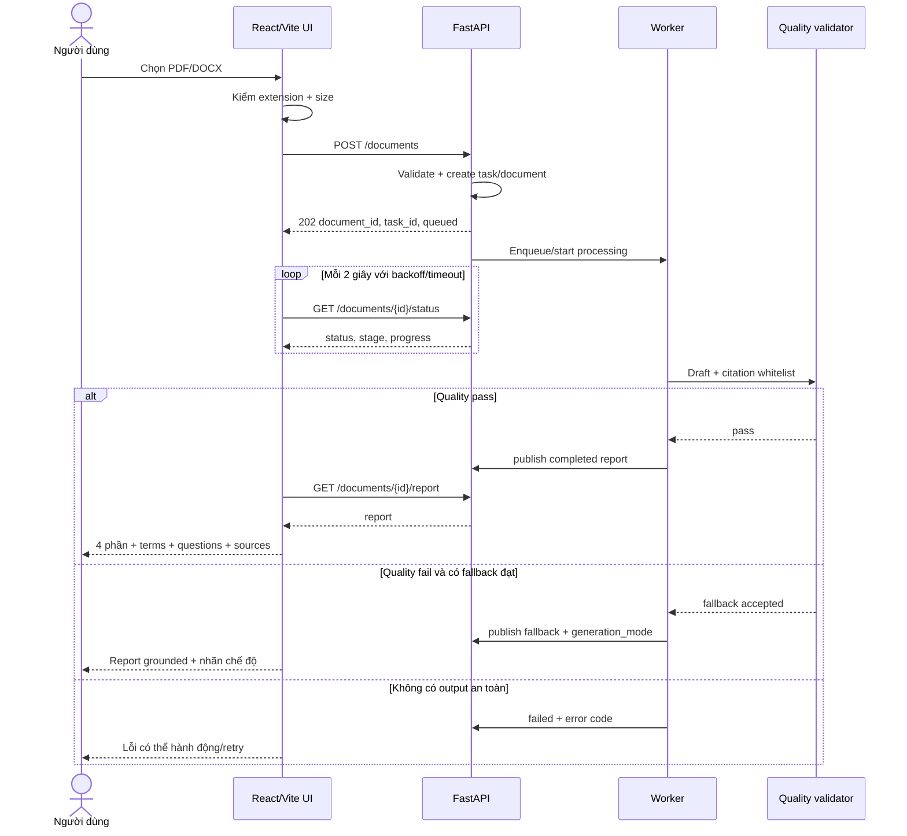
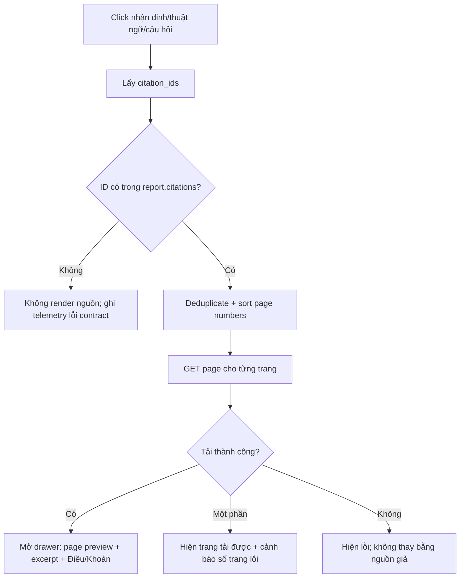
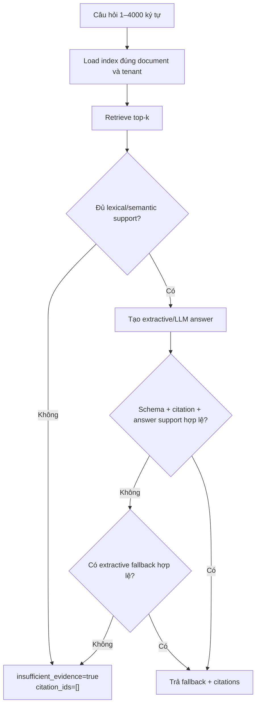
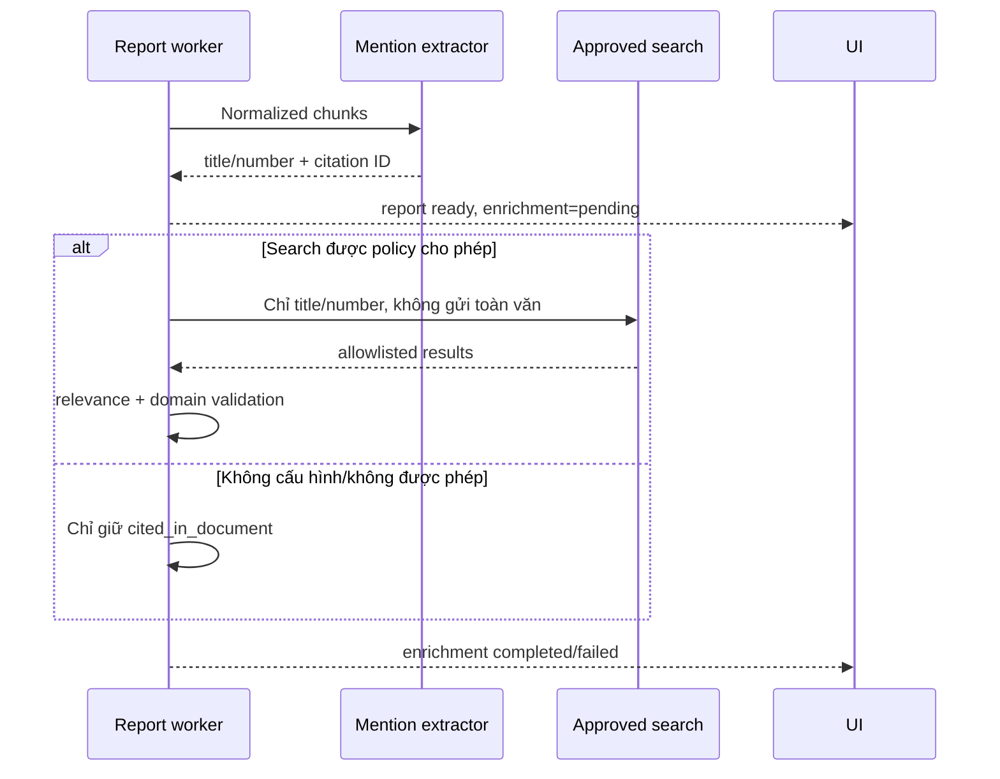

# Product and System Flows — Antipaper

## 1. Context

Luồng Antipaper phải giúp người dùng chuyển từ “có một file dài” sang “có đủ căn cứ
để họp” mà không che giấu trạng thái xử lý, chất lượng hoặc giới hạn nguồn. Tài liệu này
là chuẩn hành vi cho frontend, backend và QA; hợp đồng field cụ thể nằm trong
`API_CONTRACT.md`.

## 2. Problem Statement

Các lỗi UX nguy hiểm nhất không phải lỗi hiển thị mà là:

- báo hoàn tất khi output bắt buộc chưa đủ hoặc enrichment vẫn đang thiếu;
- hiển thị citation mà server không xác thực;
- mở history cũ như thể report vẫn tồn tại sau restart;
- trả lời tự tin khi retrieval không đủ support;
- đưa nguồn ngoài vào câu trả lời nhưng không phân biệt với tài liệu gốc.

## 3. Technical Deep-Dive

### 3.1 Luồng chính: upload tới report

#### Pre-conditions

- Người dùng đã xác nhận file được phép xử lý theo phân loại dữ liệu.
- File có extension PDF/DOCX, ≤25 MB theo MVP.
- Với pilot, session hợp lệ và user có quyền upload trong workspace.

#### Post-conditions

- `completed`: report bắt buộc đã publish atomically và quality status có thể truy vấn.
- `failed`: không có report bị coi là hoàn chỉnh; task history có error code.
- User cancel/navigation không mặc nhiên xóa task; UI có thể khôi phục bằng document ID
  trong cùng active runtime ở MVP.

### 3.2 State machine giao diện

| UI state | Điều kiện vào | Hành vi | Điều kiện ra |
|---|---|---|---|
| `upload.idle` | Chưa chọn file | Hiện dropzone và policy note | Chọn file |
| `upload.invalid` | Sai type/size | Chặn submit, nêu lỗi | Chọn file khác |
| `upload.submitting` | Đã submit | Disable nút lặp, hiện progress | 202 hoặc lỗi |
| `document.polling` | Có document ID, non-terminal | Hiện stage/progress/elapsed | completed/failed/network timeout |
| `document.ready` | Report tải thành công | Bật tabs, chat và citation | Upload mới/history |
| `document.failed` | Backend failed | Hiện mã lỗi, retry bằng upload mới | Upload lại |
| `document.stale` | History còn nhưng report 404 | Giải thích report không còn | Upload lại |
| `citation.loading` | User chọn citation | Drawer skeleton | Page loaded/error |
| `qa.answering` | Question hợp lệ | Append user message, disable duplicate send | Answer/error |
| `qa.refused` | insufficient evidence | Hiện từ chối, không tạo badge nguồn | Câu hỏi mới |

### 3.3 Luồng xem citation

Quy tắc hiển thị:

- Nhãn ưu tiên `Trang N · Điều X · Khoản Y`; field không có thì bỏ, không suy đoán.
- Excerpt được highlight trên text hoặc preview nếu có mapping; MVP có thể hiển thị
  excerpt cạnh page preview.
- DOCX hiện tại phải hiển thị “Vị trí logic trong tài liệu; số trang in chưa khả dụng”
  vì parser gom nội dung thành page 1.
- Citation của related web source không thay thế citation của mention trong file gốc.

### 3.4 Luồng Q&A và từ chối

Các trường hợp bắt buộc từ chối:

- không có chunk overlap/support đủ;
- câu hỏi đòi thông tin hiện tại hoặc ngoài file mà nguồn ngoài không được bật;
- citation ID lạ, không thuộc retrieval set hoặc metadata/excerpt không khớp;
- hỏi “Điều/Khoản X” nhưng evidence không khớp legal identifier;
- model output có claim không được support và không có fallback hợp lệ.

Câu từ chối mặc định: `Không đủ thông tin trong tài liệu để trả lời.` UI có thể gợi ý
người dùng diễn đạt cụ thể hơn nhưng không được tự thêm câu trả lời.

### 3.5 Luồng văn bản liên quan

UI phân loại:

- `cited_in_document`: căn cứ được nhắc trong tài liệu, chưa xác minh web.
- `official_reference`: đối chiếu nguồn chính thức được allowlist.
- `secondary_reference`: nguồn thứ cấp, chỉ tham khảo và không dùng làm căn cứ Q&A
  mặc định.

### 3.6 Luồng history

1. UI gửi `X-User-ID` ở MVP hoặc access token ở pilot.
2. API chỉ trả task thuộc user/tenant đã xác thực.
3. Filter theo status/type, phân trang limit/offset.
4. Chọn task `completed`:
   - nếu active report còn tồn tại: mở report;
   - nếu 404: state `document.stale`, yêu cầu upload lại;
   - không tự chạy lại từ file vì MVP không persist file.
5. Nội dung câu hỏi nhạy cảm không nên làm `display_name` ở pilot; dùng label rút gọn/
   redacted hoặc cấu hình không lưu.

### 3.7 Error flows

| Mã/nhóm | UX | Retry |
|---|---|---|
| `UNSUPPORTED_FILE` | Nêu chỉ hỗ trợ PDF/DOCX | Chọn file khác |
| `FILE_TOO_LARGE` | Nêu giới hạn 25 MB | Nén/chọn file khác |
| `EMPTY_OR_SCANNED_DOCUMENT` (target) | Nêu cần OCR/chưa hỗ trợ | Dùng bản native hoặc OCR approved |
| `PROCESSING_FAILED` | Nêu task thất bại, không show partial report | Upload lại; support dùng task ID |
| `MODEL_TIMEOUT` | Nêu quá hạn; có thể retry | Có nếu `retryable=true` |
| `QUALITY_GATE_FAILED` (target) | Nêu không tạo được báo cáo đủ tin cậy | Không auto-loop; review |
| `DOCUMENT_NOT_FOUND` | Active report không còn | Upload lại |
| 401/403 (pilot) | Đăng nhập lại/không có quyền | Không đổi user ID client-side |
| Network polling error | Giữ document ID, cho “Thử lại” | Backoff, không tạo upload mới ngầm |

### 3.8 Happy-path demo script

1. Mở landing và giải thích chỉ dùng tài liệu công khai cho demo.
2. Upload `data/02.pdf` (44 trang) hoặc tài liệu công khai ≥40 trang đã xác nhận.
3. Quan sát stages và đồng hồ; ghi cold-run evidence.
4. Mở bốn phần report, một thuật ngữ, một câu hỏi phản biện.
5. Click citation để đối chiếu page/Điều/Khoản với bản gốc.
6. Hỏi một câu answerable, mở citation.
7. Hỏi một câu ngoài tài liệu, chứng minh từ chối không citation.
8. Mở văn bản liên quan và giải thích provenance.
9. Mở history; nêu rõ giới hạn in-memory của demo và kiến trúc pilot.

## 4. Strategic Recommendations

1. Dùng một state machine chung sinh type cho backend/frontend thay vì danh sách stage
   lệch nhau như hiện tại.
2. Phân biệt `report_ready` và `enrichment_ready` trong SLA/UI; định nghĩa rõ “hoàn
   chỉnh” cho kịch bản demo.
3. Thêm `quality_failed` hoặc quality object chuẩn thay vì trả `completed` dựa chủ yếu
   vào pipeline không exception.
4. Pilot phải bỏ identity tự khai, owner-scope mọi document endpoint và thêm explicit
   deletion flow.
5. Usability test phải đo thời gian người dùng tìm và xác nhận một claim, không chỉ đo
   latency máy.
