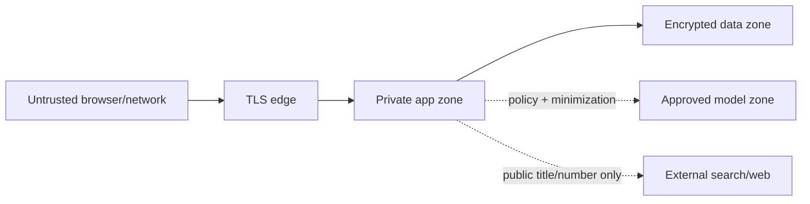

# Security, Privacy and AI Safety — Antipaper

## 1. Context

Antipaper hướng tới cơ quan hành chính và có thể xử lý tài liệu chưa công khai. Mặc dù
MVP chỉ dùng tài liệu công khai, kiến trúc pilot phải giả định file, tên file, câu hỏi,
đoạn trích và metadata đều có thể nhạy cảm. Citation chính xác là control về integrity,
không thay thế confidentiality, authentication hoặc authorization.

## 2. Problem Statement

Threat surface gồm upload file không tin cậy, parser native, prompt injection nằm trong
tài liệu, provider AI/search bên ngoài, identifier đoán được/đánh cắp, log/history và
derivative data. Hiện trạng chưa có authentication thực, document endpoint chưa
owner-scope và CORS wildcard; vì vậy chỉ phù hợp demo local với tài liệu công khai.

## 3. Technical Deep-Dive

### 3.1 Trust boundaries



Mỗi mũi tên qua boundary cần authentication, authorization, minimization, timeout,
logging policy và egress allowlist tương ứng.

### 3.2 Assets và adversaries

| Asset | Rủi ro | Tác nhân |
|---|---|---|
| Original/derived content | Lộ lọt, giữ quá hạn, cross-tenant | User khác, attacker, operator, provider |
| Citation/report integrity | Bịa nguồn, sửa mapping, stale version | Prompt injection, bug, malicious file |
| Credentials | Lộ API key/token | Log, repo, client bundle, operator error |
| Service availability | Zip/PDF bomb, file parser crash, provider exhaustion | Untrusted uploader |
| Audit | Xóa/sửa dấu vết, log injection | Privileged/malicious actor |
| Legal reference | Nguồn giả/secondary bị coi là chính thức | Search poisoning, domain compromise |

### 3.3 Threat model và controls

| Threat | Hiện trạng | Control bắt buộc trước pilot |
|---|---|---|
| Spoofed identity | `X-User-ID` client tự đặt | OIDC/SAML; server-derived subject/tenant |
| IDOR document access | UUID endpoint không owner-check | Authorization cho status/report/page/Q&A |
| Malicious upload | Extension + size only | MIME/magic, parser sandbox, page/decompression limits, malware scan |
| PDF parser exploit | Parser cùng app process | Isolated worker/container, non-root, resource limit, patch SLA |
| Prompt injection in document | Q&A instruction coi context untrusted | Structured prompt, no tools/network, output validation |
| Hallucinated citation | Whitelist/metadata/excerpt validation | Giữ fail-closed; sign/version lineage |
| Data exfiltration to LLM | Optional public endpoint | Policy gateway, private deployment, evidence minimization, DLP |
| Data exfiltration to search | Chỉ title/number intended | Egress allowlist; disable for internal; query audit không body |
| Sensitive logs/history | Request logs không body; history lưu display name | Redaction, do not store question by default, access/retention |
| CORS abuse | `allow_origins=["*"]` + credentials | Exact approved origins, secure cookies/token rules |
| Resource exhaustion | 25 MB, pool 3 | Rate limit, quotas, queue depth, max pages, timeout/cancel |
| SSRF via URLs | Search client calls fixed base; UI may open result URL | Fixed allowlist, URL parse/resolve checks, safe-link UX |
| Supply-chain compromise | Lockfile frontend; broad Python ranges | Lock Python deps, SBOM, signature/vuln scan |

### 3.4 Authentication and authorization target

Roles tối thiểu:

| Role | Upload/read own workspace | Q&A | Manage users/policy | View audit |
|---|---:|---:|---:|---:|
| Viewer | Read | Có | Không | Không |
| Contributor | Có | Có | Không | Không |
| Workspace admin | Có | Có | Workspace only | Workspace only |
| Security auditor | Metadata theo scope | Không cần | Không | Có |
| Platform admin | Break-glass có audit | Theo policy | Platform | Có |

Authorization object-level áp cho document, version, report, page, Q&A và history.
Platform admin không mặc nhiên được đọc content; break-glass cần reason, approval và
audit.

### 3.5 Upload security

1. Enforce request/body limit ở reverse proxy và API.
2. Kiểm extension, declared MIME và magic bytes; mismatch bị từ chối.
3. Giới hạn page count, object count, embedded file, decompressed size, parser time/RAM.
4. Malware scan theo công cụ được đơn vị duyệt.
5. Parser chạy isolated, non-root, read-only filesystem, no outbound network.
6. File tạm có permission chặt và được purge cả success/failure.
7. Scanned/empty/encrypted/corrupt file trả lỗi riêng, không sinh report rỗng.

### 3.6 AI safety controls

#### Input

- Document text luôn là `UNTRUSTED_EVIDENCE`, không được nâng thành system instruction.
- Q&A model không có tool, browsing, file system hoặc code execution.
- Evidence window chỉ gồm chunks của đúng document/tenant/request.
- Không đưa secret, user token hoặc internal URL vào prompt.

#### Output

- Parse structured schema; reject extra/invalid fields.
- Citation IDs phải thuộc whitelist và retrieved set.
- Claim-support validation; output không supported dùng extractive fallback hoặc từ chối.
- Related external source mang provenance/type riêng, không nhập ngầm vào grounded answer.
- Ghi model/prompt version và generation mode nhưng không log prompt body mặc định.

#### Provider governance

- Data Processing Agreement, location/residency, retention/no-training và incident terms
  phải được phê duyệt.
- Model endpoint/model nằm trong allowlist của gateway.
- Kill switch tắt egress/provider không cần redeploy.
- Budget/token/quota per tenant; timeout và circuit breaker.

### 3.7 Cryptography and secrets

- TLS 1.2+ in transit; mTLS/service identity nội bộ nếu nền tảng hỗ trợ.
- Encryption at rest cho object, DB, backup; keys theo KMS/HSM của đơn vị.
- Secret không commit, không ở frontend env/client bundle, không ghi log.
- Rotate credential theo policy và ngay khi nghi ngờ lộ.
- Signed URL preview thời hạn ngắn, scope một object, không public bucket.

### 3.8 Logging, audit and privacy

Application logs được phép ghi:

```text
timestamp, request_id, task_id, route template, status,
stage, duration, byte/page buckets, error code, version
```

Không ghi:

```text
document body, excerpt, question/answer, Authorization,
API key, raw provider response, signed URL, full sensitive filename
```

Audit events: login, upload, read/download, Q&A request metadata, share/export, delete,
role/policy/config/model change, break-glass và failed authorization.

### 3.9 Security gates

| Gate | Demo public | Pilot internal |
|---|---:|---:|
| No committed secrets | Bắt buộc | Bắt buộc |
| Dependency/static scan | Bắt buộc | Bắt buộc |
| Auth + object authorization | Có thể chưa có nếu local-only | Bắt buộc |
| Exact CORS/TLS | Local caveat | Bắt buộc |
| Parser isolation/malware scan | Khuyến nghị | Bắt buộc |
| Provider/privacy approval | Chỉ public data | Bắt buộc |
| Retention/delete verification | Ghi rõ ephemeral | Bắt buộc |
| Pen test/threat model sign-off | Không | Bắt buộc trước mở rộng |

### 3.10 Incident response minimum

1. Ngắt egress/model/search bằng kill switch.
2. Disable credential/session bị ảnh hưởng.
3. Bảo toàn audit và xác định tenant/document/time window.
4. Purge derivative/cache theo scope khi được phép.
5. Thông báo theo quy trình đơn vị và nghĩa vụ pháp lý áp dụng.
6. Rotate secret, patch, test regression và chỉ reopen sau sign-off.

## 4. Strategic Recommendations

1. Gắn nhãn rõ trong UI/API: bản hiện tại chỉ dùng local demo với tài liệu công khai.
2. P0 sửa IDOR/auth và CORS trước khi cho bất kỳ tài liệu nội bộ nào vào hệ thống.
3. Không bật Tavily/public LLM cho môi trường nội bộ mặc định; external access là
   policy exception, không phải developer toggle.
4. Isolate parser sớm vì upload file là bề mặt tấn công độc lập với AI.
5. Thực hiện privacy review cho history: filename và question snippet là dữ liệu, dù
   không lưu file gốc.

